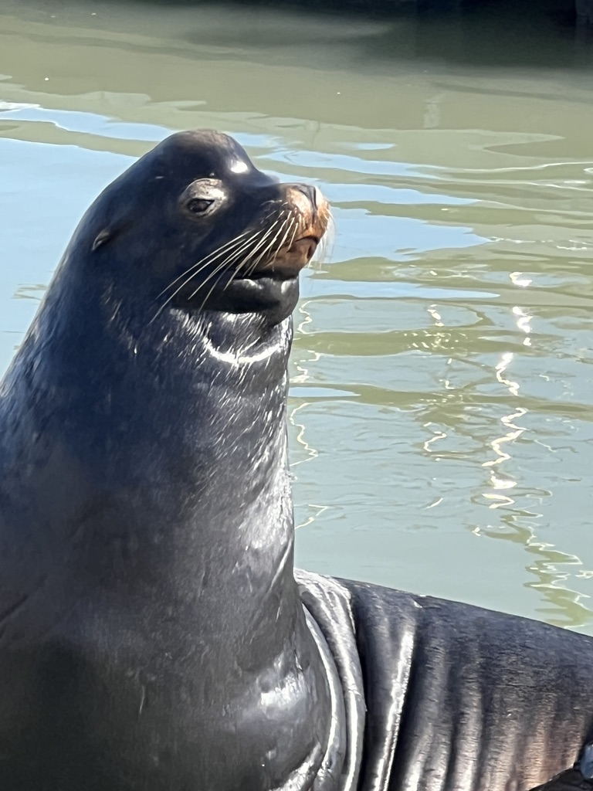
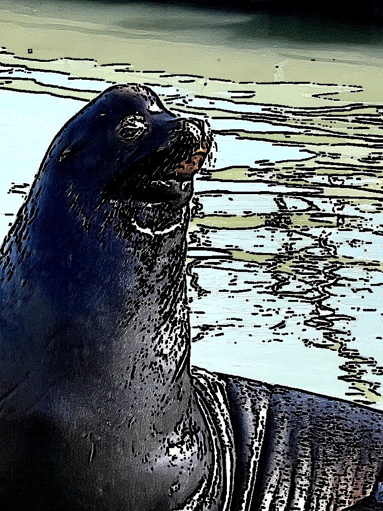
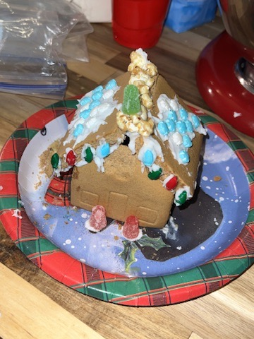
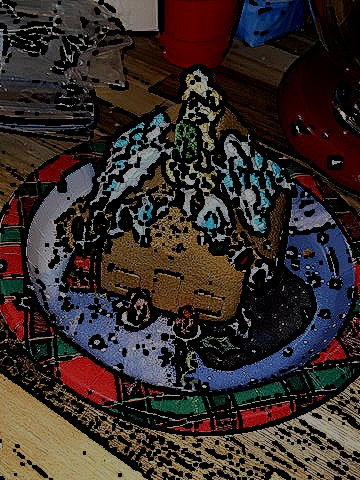

# 🎨 Becoming Cartoon Painter

일반 사진을 만화 스타일로 변환하는 Python 이미지 처리 프로젝트입니다.  
OpenCV만을 사용하며, 이미지 특성을 자동으로 분석해 최적의 파라미터를 적용합니다.

---

## 📁 프로젝트 구조

```
becomingCartoonDesigner/
├── main.py
└── image/
    └── (변환할 이미지 파일)
```

---

## ⚙️ 요구 사항

- Python 3.x
- OpenCV
- NumPy

```bash
pip install opencv-python numpy
```

---

## 🚀 실행 방법

```bash
python3 main.py
```
혹은
```
python main.py
```

`main.py` 하단의 이미지 경로를 변환할 파일로 수정하세요.

```python
cartoonize_image('./image/myImage.jpeg')
```

---

## 🔧 동작 원리

### Step 1 — 스케치 선(Edge) 추출

| 처리 | 설명 |
|---|---|
| `cvtColor` | 흑백 변환 |
| `medianBlur` | Median Filter로 노이즈(소금-후추) 제거 |
| `adaptiveThreshold` | 조명 차이에 강인한 적응형 이진화로 검은 테두리 추출 |
| `erode` | Erosion으로 선 두께 조정 |

### Step 2 — Sharpening Filter

Bilateral Filter(스무딩) 대신 **Sharpening Kernel**을 사용하여 색을 뭉개지 않고 경계를 선명하게 강조합니다.

```
┌               ┐
│  0   -nb   0  │
│ -nb   ct  -nb │
│  0   -nb   0  │
└               ┘
```

- **`ct` (center)**: 중앙값. 클수록 원본 색감 유지
- **`nb` (neighbor)**: 주변값. 클수록 엣지 강조

### Step 3 — 선과 색상 합성

`bitwise_and`로 색상 이미지 위에 스케치 선을 마스크로 덮어씌우고,  
`addWeighted`로 대비(contrast)와 밝기(brightness)를 최종 보정합니다.

---

## 🤖 자동 파라미터 분석 (`analyze_image`)

실행 시 이미지의 특성을 분석하여 각 파라미터의 최적값을 자동으로 계산합니다.

| 분석 항목 | 계산 방법 | 영향을 주는 파라미터 |
|---|---|---|
| **평균 밝기** (`mean`) | `np.mean(gray)` | `brightness` |
| **대비** (`std`) | `np.std(gray)` | `center`, `contrast` |
| **해상도** (`mpx`) | `width × height / 1,000,000` | `neighbor`, `thickness` |

### 파라미터 추천 기준 (실제 이미지 테스트로 축적된 값)

**brightness** — 평균 밝기 기준:

| mean 범위 | brightness |
|---|---|
| < 80 | -21 |
| < 100 | +10 |
| < 112 | -97 |
| < 115 | -48 |
| < 126 | -38 |
| < 130 | -54 |
| ≥ 130 | -111 |

**contrast** — 대비(std) 기준:

| std 범위 | contrast |
|---|---|
| < 40 | 1.8 |
| < 50 | 1.0 |
| < 65 | 0.8 |
| < 70 | 1.5 |
| ≥ 70 | 1.7 |

**neighbor** — 해상도(mpx) 기준:

| mpx 범위 | neighbor |
|---|---|
| > 4 MP | 1.8 |
| > 1 MP | 2.2 |
| ≤ 1 MP | 2.0 |

---

## 🛠️ 개발 과정 요약

1. **기본 만화 필터 구현** — Bilateral Filter + Adaptive Threshold + bitwise_and
    Bilateral Filter의 smoothing 기능이 만화 그림체의 역동적인 측면을 표현하는 데에 해친다고 생각하여 더 이상 사용하지 않기로 결정함.
2. **Sharpening Filter로 교체** — 스무딩 없이 선명한 엣지 강조
3. **실시간 조정 기능 추가** — OpenCV 트랙바로 파라미터 실시간 조정
4. **선 두께 조정 추가** — Erosion 반복 횟수로 1픽셀 단위 세밀 조정
5. **자동 분석 기능 추가** — 이미지 밝기·대비·해상도 분석 후 추천값 자동 적용
6. **파라미터 튜닝** — 이미지 테스트를 통해 분기별 최적값 누적 반영
7. **코드 정리** — 테스트용 코드 및 트랙바 제거, 자동화 완성

---

## 🖼️ 데모 및 한계점 논의

### ✅ 잘 표현되는 이미지

10장의 이미지 중 **8번, 10번** 이미지에서 만화 느낌이 가장 잘 표현됐습니다.

잘 표현되는 이미지의 공통 특성:
- **명확한 윤곽선**: 피사체와 배경의 경계가 뚜렷함
- **균일한 색상 영역**: 단색에 가까운 넓은 면적 존재
- **높은 대비(std ≥ 70)**: 밝고 어두운 영역이 명확히 분리됨

| 원본 | 만화 변환 결과 |
|:---:|:---:|
|  |  |

**잘 표현되는 이유:**  
피사체와 배경의 명암 차이가 뚜렷하여 `adaptiveThreshold`가 깔끔한 윤곽선을 잡아냅니다.  
Sharpening Filter가 색을 뭉개지 않고 경계를 강조하여 만화 특유의 선명한 느낌을 살려줍니다.

---

### ❌ 잘 표현되지 않는 이미지

10장의 이미지 중 **3번, 4번, 5번** 이미지에서 만화 느낌이 잘 표현되지 않았습니다.

잘 표현되지 않는 이미지의 공통 특성:
- **복잡한 배경**: 나뭇잎, 잔디, 군중 등 세밀한 텍스처가 많음
- **낮은 대비(std < 50)**: 전체적으로 뿌연 이미지
- **불균일한 조명**: 역광이나 강한 그림자로 피사체 내 명암 차이가 극심한 경우

| 원본 | 만화 변환 결과 |
|:---:|:---:|
|  |  |

**잘 표현되지 않는 이유:**  
복잡한 텍스처 영역에서 `adaptiveThreshold`가 불필요한 잡선을 과도하게 검출합니다.  
Sharpening Filter가 노이즈까지 함께 강조하여 지저분한 결과물이 나옵니다.

---

### ⚠️ 한계점

#### 1. 텍스처가 복잡한 이미지에 취약
`adaptiveThreshold`는 국소 영역의 밝기 차이를 기반으로 윤곽선을 추출하기 때문에,  
잔디·털·나뭇잎 등 세밀한 텍스처에서 수많은 잡선이 생성됩니다.  
실제 만화는 작가가 불필요한 선을 의도적으로 생략하지만, 이 알고리즘은 그런 판단을 할 수 없습니다.

#### 2. 파라미터가 이미지마다 다름
이미지의 밝기·대비·해상도를 분석해 자동으로 파라미터를 추천하지만,  
같은 분기에 속하는 이미지라도 피사체의 종류(인물/풍경/사물)에 따라 최적값이 달라집니다.  
현재 분기 기준은 **픽셀 통계값**에만 의존하고 있어, 피사체의 **의미적 정보(semantic)** 를 반영하지 못합니다.

#### 3. 색상 단순화 미흡
실제 만화는 색상 수를 극적으로 줄여 평면적인 느낌을 줍니다.  
현재 알고리즘은 Sharpening Filter로 원본 색상을 거의 그대로 유지하기 때문에,  
색상 단순화(color quantization) 없이는 완전한 만화 스타일을 구현하기 어렵습니다.

#### 4. 선 품질이 픽셀 단위로 조잡함
Erosion으로 선 두께를 조정하지만, 이는 단순히 흰 영역을 깎는 방식이라  
선이 울퉁불퉁하고 만화처럼 매끄럽지 않습니다.  
실제 만화의 선처럼 굵기가 변하거나 끝이 날카롭게 처리되지 않습니다.

